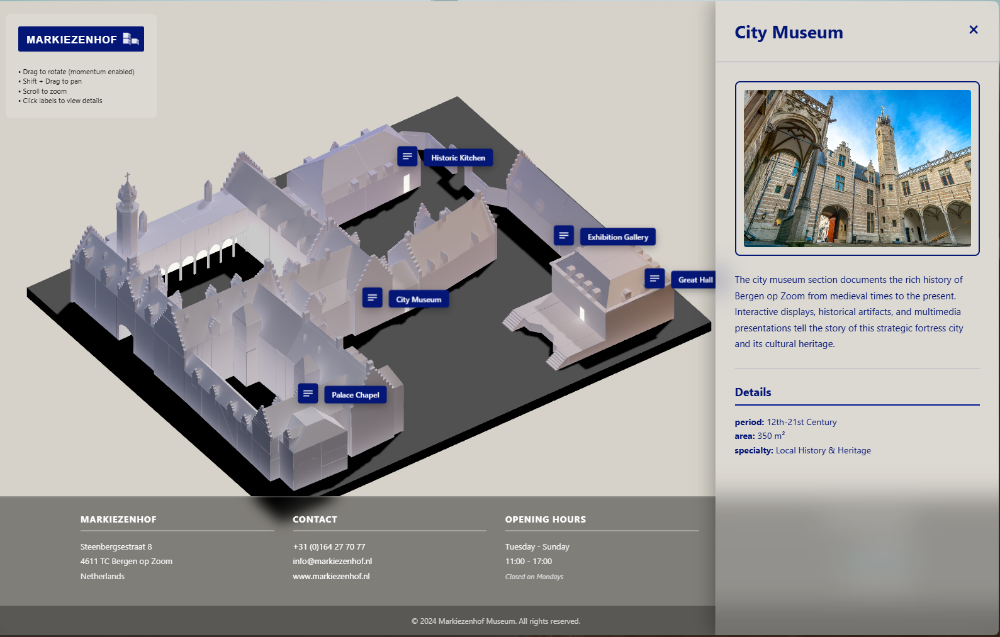

### MuseumVisualizer

MuseumVisualizer is a web-based 3D experience built with Three.js, designed to showcase a museum model accompanied by interactive informational hotspots.
The project includes two different rendering approaches: one using baked lighting from Blender and another using real-time Three.js lighting with post-processing effects.

### 🧾Description

This project loads a 3D museum model and displays informative SVG icons placed around the building.
When a user clicks on an icon, a side panel opens showing text and images about different museum rooms.
The experience includes two versions:

Baked Model Version – lighter, optimized, and using Blender light baking.

Non-Baked Version – real-time lighting in Three.js with a bloom post-processing effect applied to the emissive window material.

### 🛠 Technologies Used

Three.js – WebGL rendering

GLTF / GLB – 3D model format

Blender – Light baking

JavaScript

HTML / CSS

Three.js Postprocessing (for Non-Baked version)

### 👨🏻‍💻 Features

 Two rendering modes:

Baked Lighting Version (ScriptBakedModel):

Model with baked lighting

Emissive material added to windows

No post-processing → better performance

Non-Baked Lighting Version (ScriptNoBaked):

Real-time lighting setup in Three.js

Bloom effect using UnrealBloomPass

Neutral paper-like material for the museum building

🖼 Interactive Hotspots (SVG)
Icons placed around the museum drawing attention to points of interest.
Clicking an icon opens a side panel with images and descriptions.

🖱 Custom Camera Controls
Smooth orbit controls with limits tailored to the museum layout.

🎨 UI and Visual Identity
Includes footer, logo, info panel, and a consistent dark-navy / violet + light-beige color palette.

### 🧩 The Process

Blender Workflow

Material preparation

Baking lightmaps

Exporting models in GLB/GLTF

Three.js Implementation

Loading and configuring the museum model

Applying emissive window materials

Setting up postprocessing for bloom (Non-Baked)

Hotspot Placement

Positioning SVG icons over 3D points

Ensuring correct screen projection for responsiveness

User Interface Integration

Side panel animation

Cohesive color palette

Layout structure (header/footer)

Optimization Steps

Reducing draw calls

Adjusting materials

### 📚 What I Learned

Properly baking lighting in Blender for WebGL workflows

Balancing two rendering workflows (baked vs real-time lighting)

Implementing Three.js post-processing pipelines

Mapping 2D SVG elements onto a 3D scene consistently

Designing UI that complements a 3D experience

### ⚡How It Can Be Improved

Add guided navigation through the museum (tour mode)

Integrate spatial audio or narration

Increase loading efficiency using Draco or Meshopt compression

Add WebXR / VR

Build a lightweight CMS for editing hotspot content

Improve hotspot interactions (hover effects, categories, animations)

Auto-switch between Baked / Non-Baked depending on device performance

### ▶️ Running the Project
1. Clone the repository
cd MuseumVisualizer

2. Choose a version to run
Baked Lighting Version

cd ScriptBakedModel

Non-Baked Lighting Version

cd ScriptNoBaked

3. Run a local server

npx serve

4. Open the project

You’ll see a local URL in the terminal, usually:

http://localhost:3000
